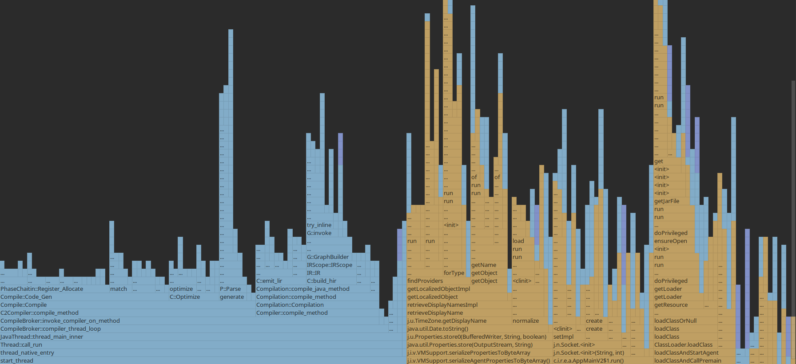
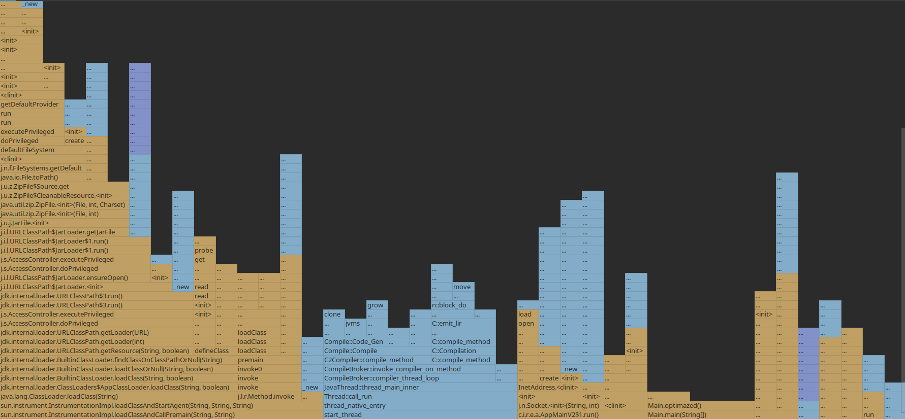

# Lab6 

### Lab code
``` java
 public void notOptimized(){
        System.out.println("\n Inside main()\n");
        String typeOfShape = "dog";
        int i = 0;
        for(;i<0xffffff;i++);
        switch(typeOfShape){
            case "dog":
                drawDog();
                break;
            case "cat":
                drawCat();
                break;
        }

        System.out.println("End");
    }

    static void drawCat()
    {
        for(int i = 0; i < 100000000; i++)
        {
            //process of drawing
            try {
                Thread.sleep(1000);
            } catch (InterruptedException e) {
                e.printStackTrace();
            }
        }

        return;
    }

    static void drawDog()
    {
        for(int i = 0; i < 1000000000; i++)
        {
            //process of drawing
            try {
                Thread.sleep(1000);
            } catch (InterruptedException e) {
                e.printStackTrace();
            }
        }
        return;
    }

```

### Task
Profile optimized and non optimized code .
For profiling code i will use CPU Profiler which build-in into the IDE.
For code optimization i will delete all static methods in the `static void drawDog()` and  `static void drawCat()`
With this optimization , out code executed better and faster . 

### Optimized code
``` java

    public void optimazed(){
        System.out.println("\n Inside main()\n");
        String typeOfShape = "dog";
        int i = 0;
        for(;i<0xffffff;i++);
        switch(typeOfShape){
            case "dog":
                drawDogOptimized();
                break;
            case "cat":
                drawCatOptimized();
                break;
        }

        System.out.println("End");
    }


    static void drawCatOptimized()
    {
        for(int i = 0; i < 100000000; i++)
        {
            //process of drawing

        }

        return;
    }

    static void drawDogOptimized()
    {
        for(int i = 0; i < 1000000000; i++)
        {
            //process of drawing

        }
        return;
    }
```
The profiler results
### Not Optimized

 

### Optimized code profiler result
 
